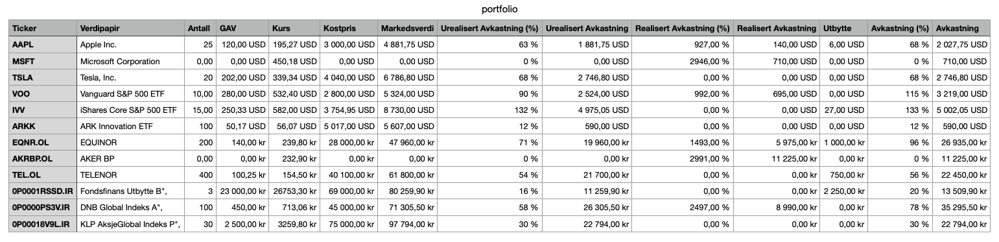

# Portfolio Performance Tracker

A Java program that analyzes your investment transactions and calculates comprehensive performance metrics across all your stocks and funds.

## Key Features
- Calculates both realized and unrealized returns
- Tracks performance across multiple transactions
- Handles dividends, buys, and sells
- Generates a Numbers-ready CSV with automatic stock price lookups

## How to Use
1. Export your transaction history from your broker as CSV
2. Save the file as `transactions.csv` in the same folder as the program

## Example on result
